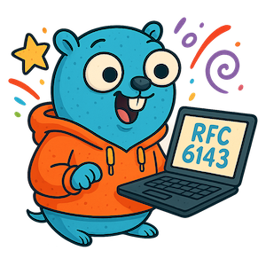

<!-- markdownlint-disable first-line-h1 no-inline-html -->

# go-vnc

A Go library for the VNC client protocol, compliant with [RFC 6143](http://tools.ietf.org/html/rfc6143).

> [!TIP]
> This library maintains API compatibility with archived `github.com/mitchellh/go-vnc` and can be used as a drop-in replacement.

Refer to [package reference](https://pkg.go.dev/github.com/tenthirtyam/go-vnc) and the `examples/` folder for more usage scenarios.

## Sponsor

[][sponsor]&nbsp;&nbsp;
[][buy-me-a-coffee]

## License

Copyright &copy; Ryan Johnson

Licensed under the [MIT License][license].

[license]: LICENSE
[sponsor]: https://github.com/sponsors/tenthirtyam
[buy-me-a-coffee]: https://buymeacoffee.com/tenthirtyam
